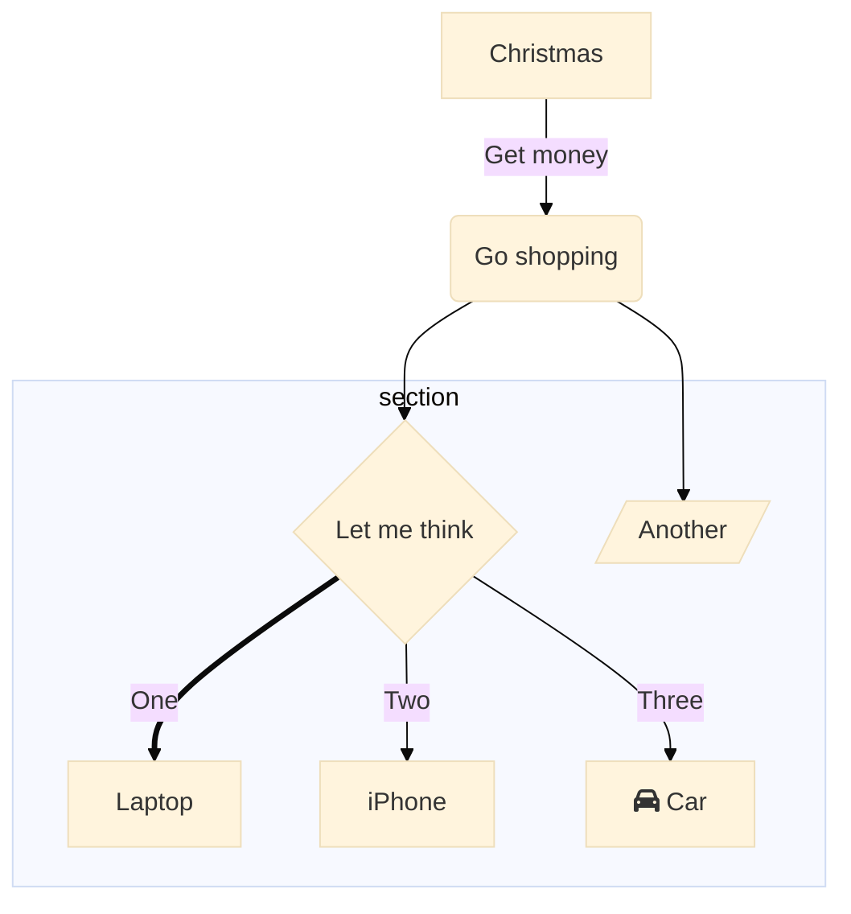

# Hi frens... 👋


# GITIGNORE!!!

Ignore entire directories, just by including their paths and putting a / on the end:
```
node_modules/
```
# Error updating Gem in Windows 10?

I had error when I was updating it, my only problem was not adding --system at the end...

```
gem update --system
```

[](https://spotify-github-profile.vercel.app/api/view?uid=1276520269&redirect=true)



- 🔭 I’m currently working on ... [something](TempEntry.md)
- 🌱 I’m currently learning ... NextJS, Astro, Moralis, ...more Frontend
- 👯 I’m looking to collaborate on ... when you meet me.
- 🤔 I’m looking for help with ...
- 💬 Ask me about anything in Twitter(active there)
- 📫 How to reach me: @ Twitter most of the time
- 😄 Important design resource: https://github.com/Alaev/design-resources-for-developers
- ⚡ Fun fact: ...
