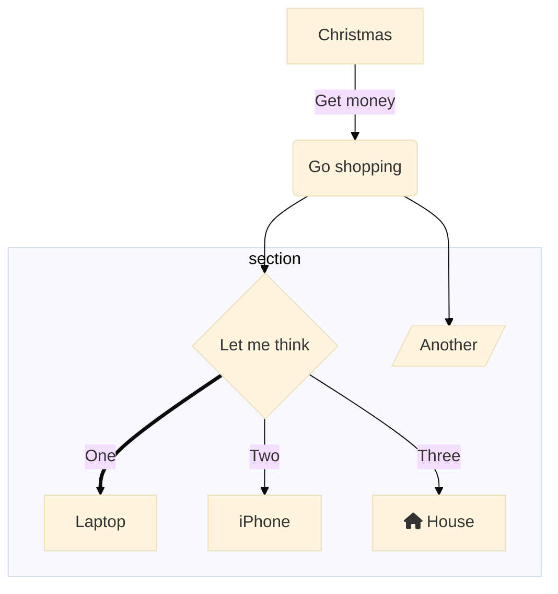

# Hi frens... 👋


# GITIGNORE!!!

Ignore entire directories, just by including their paths and putting a / on the end:
```
node_modules/
```

---

# Useful Free Resources in Github

1. https://github.com/ripienaar/free-for-dev - list is only for as-a-Service offerings with FREE tier
2. https://github.com/EbookFoundation/free-programming-books - FREE DEV E-BOOKS
3. https://github.com/ryanmcdermott/clean-code-javascript
4. https://github.com/Alaev/design-resources-for-developers - Important design resource for DEV
5. https://github.com/leonardomso/33-js-concepts - 33 JS Concepts
6. https://github.com/trekhleb/javascript-algorithms - JavaScript Algorithms
7. https://github.com/Asabeneh/30-Days-Of-JavaScript - 30 Days of JavaScript

# Error updating Gem in Windows 10?

I had error when I was updating it, my only problem was not adding --system at the end...

```
gem update --system
```




- 🔭 I’m currently working on ... Rust
- 🌱 I’m currently learning ... Rust
- 👯 I’m looking to collaborate on ... Rust
- 🤔 I’m looking for help with ... Rust
- 💬 Ask me about anything? I'm not avaiable
- 📫 How to reach me: E-Mail me on Gmail
- 😄 Important design resource: https://github.com/Alaev/design-resources-for-developers
- ⚡ Fun fact: ...

- Archived... [something](TempEntry.md)
