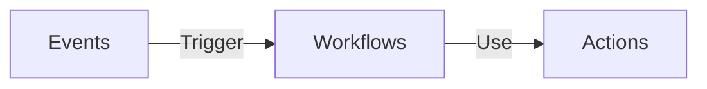

# GitHub Actions

## Events
Something that trigger execution of workflows.

## Workflows
Inside the workflow you specify your action. Specified in the YAML file.

## Actions
- Reusable units of code.
- Post Action to Github Marketplace
- Storing shared actions.